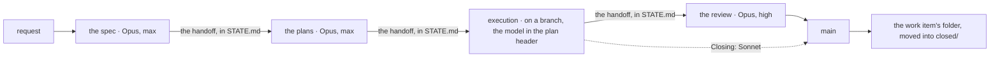
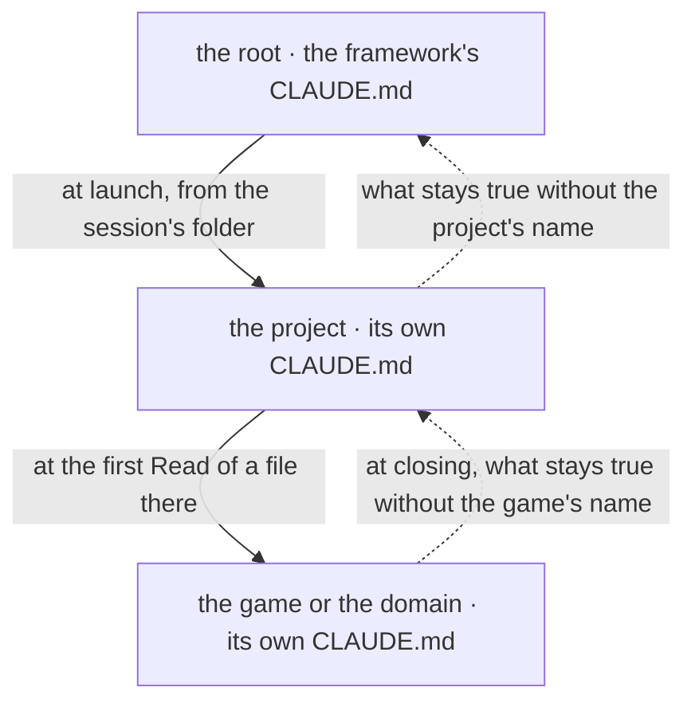
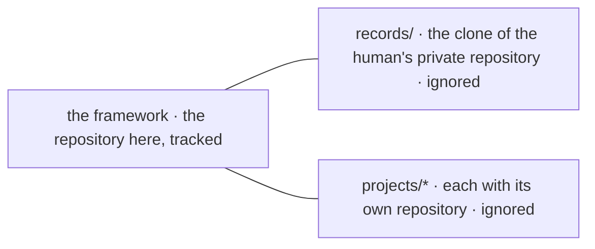

# claude-env

A workspace for Claude Code where work lasting days survives the end of a conversation:
everything a new session needs to continue another's work sits in files. It is for anyone
already using Claude Code on projects too big for one conversation, alone or in a small
team.

The repository holds the **framework**: rules, house skills, verification tools and a new
project's template. Projects sit in `projects/`, each in its own
repository.

## How it works



A request goes through four new sessions, each opened by the human: the spec (the document
deciding what and how), the plans, execution on a branch, and the review, which
merges the branch into `main`. Between sessions passes the **handoff** (the note in
`STATE.md` for the next session): model, effort and the prompt to paste.

A plan with `Closing: Sonnet` goes from execution straight into `main`. The full rules:
[CLAUDE.md](CLAUDE.md).

## A whole example

A two-line work item through all four sessions, with every file each one left, read
without running anything: [example/README.md](example/README.md).

## Quick start

### What it needs

The only list of requirements; each version beside the command that reads it.

| Needs | Version | How to read it | What fails without it |
|---|---|---|---|
| `git` | 2.30 or newer, for `git subtree split` | `git --version` | moving a record with its history |
| `python3` | 3.9 or newer, standard library only | `python3 --version` | every tool in `bin/` |
| `node` | any | `node --version` | the hooks of ponytail, caveman and RTK: three plugins of four inert |
| the `claude` binary | any | `command -v claude` | confirming the restore |
| `gh` | any, authenticated | `gh auth status` | only work with new repositories, not the restore |

### The steps

1. **The copy.** On GitHub, "Use this template"; or a clone:

   ```bash
   git clone <repository-url> claude-env
   ```

2. **The restore.** It clones each plugin at its SHA in `plugins.lock.json` into
   `~/.claude/`, where Claude Code looks, then exits with 0 or says what is missing:

   ```bash
   cd claude-env && ./bin/restore-env.sh
   ```

   It bypasses `claude plugin install`, which takes no pinned version; clones over HTTPS,
   since SSH fails without a key in the agent; merges `~/.claude/` settings, never rewriting
   them; makes an empty `records/` skeleton if missing.

3. **The check.** That the environment is whole:

   ```bash
   ./bin/check-lock.sh && python3 bin/check-docs.py . && ./bin/check-maps.sh
   ```

4. **The first project**, copied from the template, in its own repository:

   ```bash
   mkdir -p projects/<name> && cp -r template/. projects/<name>/
   ```

   ```bash
   cd projects/<name> && git init -q -b main && git add -A && git commit -q -m "The project starts from the template"
   ```

5. **The first session**, opened in `projects/<name>`, on Opus with effort `max`, with the
   request: what is wanted, that the requirements are settled, and that the spec goes in
   the work item's folder, `records/work/`. The tutorial carries it through:
   [The first work item, through the four sessions](docs/tutorial/first-work-item.md).

## How to adapt it

| For | What changes | Worth knowing |
|---|---|---|
| another language | the language rule in the house rules, `records/house-rules.md` | the framework uses one language; this copy is English |
| other models | the "Who does what" table in `CLAUDE.md` and each plan's header | on one model, still four sessions; only execution's saving is lost |
| without a plugin | `plugins.lock.json`, remade with `bin/make-lock.py` from the machine's install, then `restore-env.sh` | without superpowers, "The order of the skills" in `CLAUDE.md` invokes nothing; without ponytail, nothing reins in the code; without caveman, answers stay uncompressed; without RTK, command output enters the conversation whole |
| without the personal layer | nothing: the framework runs without `records/` | records stay on one machine, without history |
| the records in git | a private repository, cloned into `records/` | the framework ignores it; `restore-env.sh` makes the skeleton only if missing |
| local models | the `local-workers` skill, which builds `records/local-workers.md` | without it, execution does all in the session and says why, once |
| other documentation thresholds | the constants in `bin/check-docs.py`: 400 lines per document, 70 characters for a repeated phrase, 4 lines per paragraph | the verifier's test fixes them; they change together |
| another project skeleton | `template/` | the tutorial and the new-project guide copy it whole |
| one's own rules | `CLAUDE.local.md`, which loads `records/house-rules.md` | the personal stays out of the framework; git ignores both |

## The documentation map

| If… | Then | Where |
|---|---|---|
| first encounter | the tutorial, once, hands on the keyboard | [The first work item, through the four sessions](docs/tutorial/first-work-item.md) |
| a whole work item, read, not run | the example | [The greeting](example/README.md) |
| an unclear word | the glossary | [Glossary](docs/reference/glossary.md) |
| what is in progress or waiting | the work index | `records/work/INDEX.md` |
| why a rule is so | the decisions | `records/decisions/INDEX.md` |
| starting a new project | a how-to guide | [How to start a new project](docs/how-to/start-a-new-project.md) |
| the environment broke | a how-to guide | [How to solve an environment problem](docs/how-to/fix-an-environment-problem.md) |
| someone hit this problem before | the journal index | `records/journal/INDEX.md` |
| what a folder or file is | reference | [The structure of the workspace](docs/reference/structure.md) |
| what breaks if something is touched | the impact map | [IMPACT.md](IMPACT.md) |
| all documentation, by kind | the table of contents | [docs/README.md](docs/README.md) |

## Why it is made this way

### The work lives in files, not in the conversation

A conversation ends, and the real work lasts for days. The state file, `STATE.md`, says
where things were left; the records keep what was decided and what it cost; a work item's
folder keeps the spec and the plan. The explanation:
[Splitting the work across models](docs/explanation/splitting-work-across-models.md).

### Four sessions, because re-reading the conversation costs

A session is paid for by the step, and at every step it re-reads the whole conversation.
The discussion in which the requirements are settled is the expensive part, so it closes
after the spec, and the plans, execution and the review start empty, from files only.

Execution runs on the cheaper model named in the plan header. Also in the explanation
above.

### Where a session is opened and where it writes what it found



Reading goes down: a project's session is opened in its folder, because Claude Code loads
at launch only the `CLAUDE.md` of the starting folder and of its parents, and that of a
subfolder only at the first file read from there with the Read tool. Writing climbs: at
closing, every thing found is written at the first level that contains it whole.

What a new session reads, in order:

1. `CLAUDE.md`: it loads by itself.
2. The repository's `STATE.md`: where things were left, plus the handoff. The one at the
   root is local and does not come with the clone.
3. The work item's folder, in the repository's records: `README.md`, then the plan.
4. [IMPACT.md](IMPACT.md), before changing something.

The rules, with their reasons, are in [CLAUDE.md](CLAUDE.md), under "A project's session".

### Three kinds of repository, only one tracked here



The framework is what holds on any machine. `records/`, the **personal layer**, is the
clone of a repository of the human's: the records, the agent's memory, the house rules and
the local workers describe a person and their machines. The framework runs whole without
it, and the restore makes its empty skeleton.

No file of the framework links there: `check-docs.py` fails on such a link, because on
another machine it is broken. The projects each have their own repository. At length:
[The structure of the workspace](docs/reference/structure.md).

### No subagents

No session sends work to other Claude instances: agents started at the same time share the
same allowance and all stop at once, returning nothing. Execution works alone, plus the
local workers, one at a time. The reason, in
[Splitting the work across models](docs/explanation/splitting-work-across-models.md).

## How it is checked

`tests/` holds the tests of the tools in `bin/`, and `./test` runs them all, plus the tests
of the projects and of the example; a test that cannot run on the machine at hand exits
with 77 and is counted "skipped", not failed. The verification tools:

- `bin/check-docs.py`: the broken links, the documents that cannot be reached by clicking
  from `README.md`, the repeated phrases, the size, the long paragraphs;
- `bin/check-maps.sh`: every verifiable row of every `IMPACT.md`;
- `bin/check-lock.sh`: every SHA in `plugins.lock.json` exists in its repository;
- `bin/values.py`: no command, path or number has disappeared from a rewritten document,
  compared with a revision;
- `bin/diagrams.html`: draws the Mermaid diagrams of a document, in the application's
  browser, with the "diagrams" configuration in `.claude/launch.json`.

At length: [How to check that a plugin really works](docs/how-to/check-a-plugin-works.md). The
guides call `/usr/bin/grep` on its path, to bypass the aliases in the session; the BSD
variant on macOS is not measured.

## The plugins

Four pinned plugins, read from `plugins.lock.json`:

| Plugin | The layer it touches | Why it is here | How it is used |
|---|---|---|---|
| `superpowers` | the order of the work | the process skills: brainstorming, plans, TDD, debugging | invoked by name, `superpowers:<skill>` |
| `ponytail` | how much code is written | the ladder that stops at the first rung that holds | 6 slash commands, plus the permanent mode |
| `caveman` | how the answer is worded | compression of the output, without technical loss | `/caveman <level>` |
| `rtk-plugin` | how much of a command's output reaches the conversation | a proxy on development commands | hook, transparent |

The reference of each: [superpowers](docs/reference/superpowers.md),
[ponytail](docs/reference/ponytail.md), [caveman](docs/reference/caveman.md),
[rtk](docs/reference/rtk.md). The skills brought by the Claude application are not pinned
here: the lockfile holds only the plugins that `restore-env.sh` restores.

A plugin evaluated and rejected, Understand-Anything, is in
[What each plugin does and when it is worth it](docs/explanation/what-each-plugin-does.md).

## The landmarks, re-measured

No figure is written from memory and none is dated. The block below prints them all, from
the workspace root:

```bash
printf 'tools in bin/         %s\n' "$(git ls-files bin | wc -l)"
printf 'documents in docs/    %s\n' "$(find docs -name '*.md' | wc -l)"
printf 'files in template/    %s\n' "$(find template -type f | wc -l)"
printf 'personal layer        %s\n' "$([ -d records ] && echo present || echo absent)"
printf 'projects in projects/ %s\n' "$(ls -d projects/*/ 2>/dev/null | wc -l)"
printf 'pinned plugins        %s\n' "$(python3 -c 'import json;print(len(json.load(open("plugins.lock.json"))["plugins"]))')"
printf 'node                  %s\n' "$(node --version 2>/dev/null || echo MISSING)"
```

## What is not here

- **Keys, tokens, `.env` files.** They are not in the folder at all, but next to the
  services that use them.
- **The plugins.** The lockfile restores them from a few kilobytes.
- **The machine's state, and the personal layer.** `STATE.md` at the root is local: it
  describes a single machine, today. `records/` is the clone of a repository of the
  human's, not of the framework, with the laptop's journal inside. Why, in
  [The structure of the workspace](docs/reference/structure.md).
