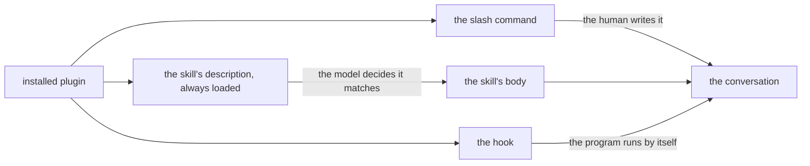

# How a plugin comes to apply

An installed plugin does nothing by the mere fact of being installed. There has to be a
moment when its content enters the conversation. There are three different mechanisms, with
different properties, and the confusion between them is the source of most "the plugin does
not work".

## A plugin enters the conversation by three roads

| Mechanism | Who decides | When it applies |
|---|---|---|
| Slash command | the human, explicitly | when the command is written |
| Description matching | the model, from the wording of the request | when the described situation appears |
| Hook | the program, automatically | at the defined moment, without a decision |

The same three roads, in words: the slash command enters when the human writes it; the
hook enters when the program runs it, without asking anyone. On the middle road only the
description enters first, and the skill's body comes only after the model decides that
the description matches the request.

### The slash command: the human decides

The most predictable. `/ponytail ultra` does exactly one thing, immediately.

Of the four plugins, three have commands: ponytail (6), caveman (5), RTK (1). Ponytail
decides how much code is written, caveman compresses the model's answers, and RTK shortens
the output of commands before it reaches the conversation.

**Superpowers has none** — the `commands/` folder does not exist in the plugin.
Superpowers is the plugin that decides the order of the work, and its 14 skills (a skill
is a set of instructions that enters the conversation when the situation matches) are
reachable exclusively through the second mechanism.

This is the most important practical consequence of the whole document: for the most
substantial of the four plugins, the wording of the request is the only lever.

### Description matching: the model decides

Each skill has a `description` field that is loaded permanently. The model reads it and
decides whether the skill applies. Only if it decides yes is the skill's body loaded.

The descriptions in superpowers are all written after the same template — the trigger
condition, never the method:

> Use when implementing any feature or bugfix, before writing implementation code

The wording does not say what the skill does. It says only when its moment is.

### The hook: the program runs without asking

It runs without asking anyone. Ponytail injects its set of rules at every
`UserPromptSubmit`, that is, at every message sent. Caveman does the same. That is why these
two modes are permanently active and are stopped by an explicit wording — "stop ponytail" —
not by merely changing the subject.

## Why the descriptions do not say what the skill does

This is the non-obvious part, and it is documented as the result of a test, not as a matter
of style.

The document `writing-skills/SKILL.md` describes what happened when a description summarized
the process. The description said "code review between tasks".

The agent did **one** review, although the diagram in the skill's body asked for **two** —
first conformity with the specification, then code quality. When the description was changed
to "use when executing implementation plans with independent tasks", without any summary of
the method, the agent read the diagram and did both reviews.

The explanation: a summary in the description becomes a shortcut. If the description seems
to already say what has to be done, the body of the skill becomes optional text.

**The consequence for whoever writes prompts:** naming the skill is not the same as applying
it. The name brings the description into the discussion; the behavior sits in the body. A
prompt that describes the **situation** leads more surely to the reading of the body than
one that mentions only the label.

The consequence for whoever writes skills is the same, turned around: a description that
summarizes the method sabotages its own content.

## Why "use skill X" is not enough

The direct wording works and is legitimate. Its limit is a different one: it assumes it is
known beforehand which of the 14 skills matches. For the tasks that cross several stages —
and those are precisely the tasks for which superpowers is worth it — the choice is not
obvious at the start.

The `using-superpowers` skill also sets an order, for the case when several match: the
process skills come first and fix the approach, then the implementation ones carry it out.
"We build X" leads first to `brainstorming`, then to implementation. "Fix this defect" leads
first to `systematic-debugging`.

This order is lost if the implementation skill is asked for directly.

## The rejected alternative: everything through commands

An obvious solution would be for every skill to have its own slash command, as with
ponytail. Superpowers chose explicitly otherwise, and the reason shows in the structure of
the descriptions.

A command requires the human to know, at the start of the request, which stage they are in.
But the right stage is often visible only after the code is read — a request formulated as
"add X" turns out to be "first understand why X is missing". Matching by description allows
the decision to come after the situation is known, not before.

The price is less predictability. The gain is that the right stage can be chosen in the
middle of the work, not only at the start.
