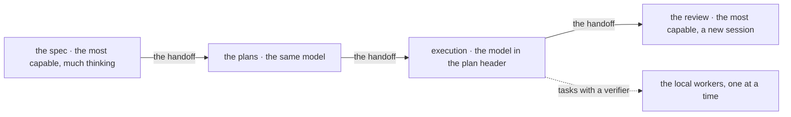

# Splitting the work across models

Not all parts of a work item require the same thinking power, nor the same conversation.
The document explains why a work item with a written plan goes through four sessions, on
different models, and where the line between them falls.

It also says where the local workers (models that run on one of the human's machines and
take small tasks) come in.

## The cost comes from the conversation re-read at every step

A session is not paid for by the human's messages, but by **steps**: every file read,
every command, every sentence of the model is a step, and a single message can start
dozens of steps.

At every step, the model receives **the whole conversation up to then**. The part
already seen costs little, because the server remembers it for a while, but it costs at
every step. It is like a notebook re-read before every question: one re-read page is
cheap, but the notebook grows, and it is re-read hundreds of times.

The measurement from which the split below came found the re-reading at almost **three
quarters** of the cost, and everything the model writes — thinking, text, commands — at
less than a fifth. It can be re-measured at any time, on the machine's logs:

```bash
python3 bin/usage.py
```

**So what costs the most is the thickness of the notebook, not the model that writes.**
An execution that starts in a new session no longer re-reads the discussion in which it
was settled what to do.

## A work item goes through four sessions, each on its own model



The spec and the plans are written on the most capable model, each in its own session.
Execution runs on the model written in the plan, usually a cheaper one, and can send the
local workers the tasks a machine can verify.

The review goes back to the most capable model, in a new session. Between every two
sessions passes a handoff.

| The session | The model | What it does |
|---|---|---|
| **the spec** | the most capable, with much thinking | talks with the human, settles the requirements, picks the architecture, writes the spec — does not write the plans |
| **the plans** | the same | reads the spec and writes the plans and the work item's `README.md` — does not write the plan's code |
| **execution** | the one in the plan header, usually a cheaper one | carries the plan to the end, without stopping between tasks, and sends to the local workers what a machine can verify |
| **review** | the most capable, in a new session | reads the execution report, the plan and the branch diff; decides what goes in |

The spec is the document that decides what is done and how; the plan is the list of
tasks, each with its verifier, that another session executes.

Between sessions passes the **handoff** (the note in `STATE.md` for the next session):
the state file (`STATE.md`, the project's state and what comes next, rewritten at every
end of session) says which model, which effort and which prompt the next session asks
for. The human opens the new session and chooses the model from the menu.

The model is not changed in the middle of a session. The long conversation would stay
behind it, and it is the expensive part.

## The expensive model sits where a mistake is expensive

Three reasons, in the order of weight.

**1. A wrong decision costs more than a wrong line.** An architecture choice is paid for
at every session after; a badly written function shows at the first test. The most
capable model sits where a mistake is expensive and hard to see.

**2. The execution of a good plan has nothing left to decide.** The plan says the files,
the code, the verifier and who does each task. What remains is careful work, not
judgment, and for it a cheaper model is enough, in a session that did not carry the
discussion.

**3. The review is cheap only in a new session.** Reopened after a pause, the planning
conversation would be written again, whole, into the server's memory, because that
memory holds for a short time. A new session reads only the report, the plan and the
diff.

## The execution's decisions are written in the plan header

The plan header is the first lines of a plan, with the model and who merges the work. The
decisions for the execution are written there, not left to it:

- **`Execution`** — the model and the effort (how much thinking time the model is given);
- **`Closing`** — who closes: the execution alone, or a review;
- **`Branch`** — where the execution works, so that `main` stays untouched until the end;
- **`Who`**, on each task — the session, or the local worker, with its model and its
  verifier (the command that says by itself whether a task succeeded).

The choice of the worker is a judgment, so it is made at planning, with the table of
models in front. The execution only follows the label. Its procedure is the `execute`
skill.

## What goes to execution and what stays

It goes to an execution session:

- the work of a written plan, entirely.

It stays in the session in which it was decided:

- the discussion with the human;
- the choice of the architecture and the writing of the plan;
- a small repair, without a plan — a new session would cost more than it saves;
- any answer that the human is waiting for now.

⚠ **The execution does not make decisions that the plan does not cover.** It stops and
asks the human. A wrongly improvised decision enters the code without anyone having made
it, and is paid for with redone work, that is, exactly with the saving for which the split
was made.

## How many at once: just one

No session sends work to subagents (another Claude, started from a session), and the
local workers work one at a time.

**Agents started at the same time stop at the same time.** They share the same session
allowance and hit it at the same moment; when they hit it, they do not come back with
half-done work, but with nothing. The incident that showed this is in the decision of 10
September.

The local workers have another reason for the same answer: a single video card. A second
model loaded pushes out the first.

## The local workers get only what a machine can verify

Small tasks, with a verifier, can go to a model that runs on one of the human's machines,
not to one paid per token.

When the project that keeps the workers is present in the workspace, it has three things:
the bridge (the tool that gives the worker the task and returns the diff only if the
verifier passed), the command that prepares the machine, and the table that says which
model can receive which kind of work.

What has to be true for the delegation to be worth it:

- **a machine can say that the task succeeded.** If the verifier is the human, nothing is
  delegated: the verification would cost more than was saved;
- **the model is measured on that kind of work.** A row without numbers in the table
  means "not used";
- **an unvalidated result does not leave the bridge.** The change reaches the repository
  only if the verifier passed;
- **the gain is mostly in "reads a lot, returns little".** What the session reads stays
  in the notebook to the end; what the worker reads does not.

## An agent's report is not evidence

A worker that says "done, it works" has reported what it believes. What changed is read
from the diff in git, and that it works is seen from the verifier run again in the
session.

The rule is the same as everywhere — **evidence before the claim** — but here it is
easier to break, because the report sounds like a verification.

## What is not a reason to split

**A work item is not handed over to look more organized.** Every new session starts with
the rules, the skills and the tools already loaded — tens of thousands of tokens before
the first word. A repair of a few steps is finished more cheaply on the spot.

**What the human is waiting for as an answer is not delegated.** If the question is "what
do you think", the answer belongs to the session they are talking to.
