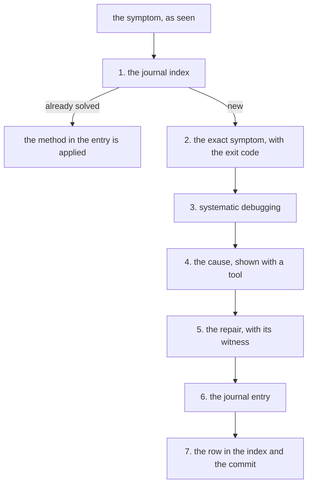

# How to solve an environment problem, and how it gets into the journal

An **environment** problem is one of the machine or of the tools — plugins, `node`,
scripts, services, hardware —, not one of a project's code. A project's pitfalls (what
cost time, with the method by which it was found) sit in its own `records/pitfalls/`.

What was found goes into the journal (the system problems solved, with the symptom, the
cause and the method). The laptop and the environment are written in the journal of the
personal layer (`records/`, the clone of a private repository of the human's, with their
records).

A machine kept by a project, or a tool of its, even installed on the laptop, goes into
the project's journal, which is in git.

The guide has two halves: how the cause is reached, and how what was found is written
down so that it serves a second time too.



First the journal index is searched, because the problem may already be solved. If it
is new, the exact symptom is written down, systematic debugging is asked for, and the
cause is shown with a tool, not guessed. The repair is proven on the command that
failed, then everything goes into the journal and its index.

All the commands are given from the workspace root (the folder into which the
environment's repository was cloned). No path in the guide is absolute.

## 1. First it is looked up whether it is already solved

Five seconds, and it saves repairing something a second time.

```bash
cat records/journal/INDEX.md
```

The index has a column of symptoms, precisely because the second time a problem is
recognized by what **is seen**, not by what it is called.

If the index says nothing, the text of the entries is searched too:

```bash
/usr/bin/grep -rn -i '<word from the error message>' records/journal/
```

⚠ **`/usr/bin/grep` is used, not `grep`.** The shell function respects `.gitignore`,
and the framework ignores `records/`: a plain `grep` finds nothing there and does not say
why.

## 2. The exact symptom is written down, before any hypothesis

Not "the script does not work", but what was seen: the command given, the complete
output, the exit code.

```bash
<command>; echo "code: $?"
```

The exit code is evidence, not a detail. In a real case, the hypothesis
predicted code 127 and reality showed 1 — and the difference between them is what
prevented a repair that would have left the true cause in place. There were two
defects, and the one found first was not the one that was striking.

A symptom summarized by the one living it loses precisely the detail that separates the
hypotheses. If someone else reports the problem, the exact form is asked for: how many,
which, when, always or sometimes.

## 3. The agent is asked for systematic debugging

The wording that brings `systematic-debugging` — the skill (a set of instructions that
enters the conversation when the situation matches) that asks for hypotheses ordered by
evidence, not repairs by guessing:

```
<command> exits with <code> and writes <the exact output>. I do not know why.
Debug systematically, do not propose the repair before the cause.
```

What the skill does: it puts the hypotheses in order, asks for each a command that can
**disprove** it, and holds the repair until the cause is shown, not suspected.

⚠ **It does not jump to "fix it".** A repair applied to the symptom leaves the cause
in place and makes the problem look solved — that is, it takes it out of sight until
the second time, when it is more expensive.

## 4. The tools that find the cause most often

| The situation | What is run |
|---|---|
| a script stops silently | `bash -x script` — the **last line executed** is read, not the one that looks suspicious |
| a script with `trap … EXIT` | the last line of the output is the trap itself, so the one before it is the place of death |
| a service is silent | `journalctl -u <unit> -n 50 --no-pager` |
| a command works in the terminal and not in the service | it is run through the service, with `sudo -k` before and no `sudo` after |
| it is not known where a program writes | it is started, then the files modified in the last minute are searched for |
| a tool seems to skip something | it is asked **what it skipped**, not only what it found |

⚠ **The environment of the test is itself a tool, and it is the least verified of
all.** A terminal has `TERM`, `stdin`, a tty and — the most treacherous — a `sudo`
timestamp; a systemd service has none of them. A test that runs in conditions
different from production can confirm a false story for years.

## 5. The repair is proven on the command that failed

The witness is the command that showed the symptom. It is not repaired until the symptom
is seen disappearing **on the same command** that showed it.

```bash
<the command that failed>; echo "code: $?"
```

⚠ **And the witness must be able to fail.** If the check passes on the old code too,
it verified nothing. The test is done in a pair: with the repair removed, it must
fail; put back, it must pass.

## 6. The journal entry is written, in the same session

It is written **in the same session**, while the evidence is still on the screen. The
rejected hypotheses are forgotten on the same day they are rejected.

The file name:

```
records/journal/YYYY-MM-DD-short-subject.md
```

The date first, so that alphabetical order is also chronological — the sorting is
done by the file system, not by a field kept up to date by hand.

The document's title is the **symptom**, not the diagnosis. The second time the
problem is recognized by what is seen, not by what it proved to be called:

- ✅ "`restore-env.sh` exits with 1 without writing anything, although the restore had succeeded"
- ❌ "A problem with `pipefail` in the chain of fallbacks"

The body has three parts, and none is optional:

### The symptom

What was seen, exactly, with the output in a code block. Plus what **should** have
appeared and did not — absence is harder to notice than presence, so it is written.

### The cause, with evidence

The command that showed it and its output. Not the explanation, but the **test**
from which the explanation comes. If several things add up to produce the defect,
they are counted: "three things add up, and none alone would have been enough".

### The method, formulated in general terms

The part that is reused. The result belongs to the problem; the method does not.

An entry without a method is a result, not a lesson. In six months nobody has the same
problem any more, but anyone can have one of the same shape.

The **rejected** hypotheses are written here too, with the reason. Without them,
someone will retry them — and a plausible hypothesis that proved wrong is exactly the
kind of thing that gets retried.

## 7. The entry gets a row in the index, then a commit

The new entry gets a row in the table in `records/journal/INDEX.md`. The row has three
cells:

| Cell | What it contains |
|---|---|
| 1 | the **symptom**, as it is seen — not the diagnosis |
| 2 | the date, `YYYY-MM-DD` |
| 3 | a markdown link to the file, with its name twice: once as text, once as target |

The target is relative to `records/journal/`, because the index sits there — so it is
only the file's name, with no folder before it. A path written from the root
passes the eyeball check and fails at `bin/check-docs.py`.

The model is a row already written in `INDEX.md`; it is copied and its three cells are
changed. The convention is at the top of the same `INDEX.md`, and the machine is
written in the entry, under "Where".

Then the check and the commit:

```bash
python3 bin/check-docs.py . && git add -A && git commit -q -m "<what was learned, not what was changed>"
```

---

## Prompts to use

**Starting the debugging** — brings `systematic-debugging`:

```
`./bin/restore-env.sh` exits with code 1 and writes no error message, although the
restore seems to have succeeded: the last line written is "skill documentation linked",
and the confirmation line is missing.

Debug systematically. Do not propose the repair before showing the cause.
```

Why it works: it gives the command, the exit code, the last line seen **and** the line
that was missing, then explicitly asks for the method.

**When a suspicion already exists** — it is declared as a suspicion, not as a fact:

```
I suspect it comes from `pipefail`, but the observed code is 1 and my hypothesis would
give 127. Check the hypothesis before we use it, and say whether the code disproves it.
```

Why it works: it names the prediction **and** the observation that does not confirm it.
A hypothesis that predicts a different code from the one seen is wrong even if the
defect it describes is real.

**When the repair is ready and has to be proven:**

```
Show the witness: run the command that failed, then remove the repair and show that
the check really fails without it.
```

**When the writing in the journal follows:**

```
/caveman off
Write the journal entry for this: the symptom, the cause with evidence, the method
formulated in general terms. Put in the hypotheses we rejected too, with the reason.
Add the row to the index.
```

`/caveman off` stops the compressed mode of the answers, so that the entry is written for
someone outside the field. The rules of the modes are in `CLAUDE.md` (the file with the
rules every session of the project loads), under "Modes".

## A complete example, from symptom to entry

How the case went that produced the entry "`restore-env.sh` exits with 1 without
writing anything" — it is found by symptom in the journal's index,
`records/journal/INDEX.md`:

1. **The measured symptom:** the script did everything it should — four markets
   cloned, four plugins, the configurations written — then exited with 1, with no
   message, and the final confirmation line was missing. It was verified separately
   that the restore really had succeeded.
2. **The first hypothesis, plausible and wrong:** variable names with diacritics.
   The defect was real, but it would have given code 127, and the observed one was 1.
   Kept as the second defect, not as the explanation.
3. **The cause, found with `bash -x`:** the last line executed was the second fallback
   in the chain that looks for the binary. `find` on a nonexistent folder exited with
   1, `pipefail` carried the code through `head`, `set -e` stopped the script — so the
   third fallback, the only one that really found the binary, was never executed.
4. **The method written in the journal**, in three general rules: the observed exit
   code is evidence; `set -e` plus `pipefail` turns a chain of fallbacks into a single
   attempt; a script that stops silently is read with `bash -x`, not by eye.

The fourth part is the only one that is still used after six months.
