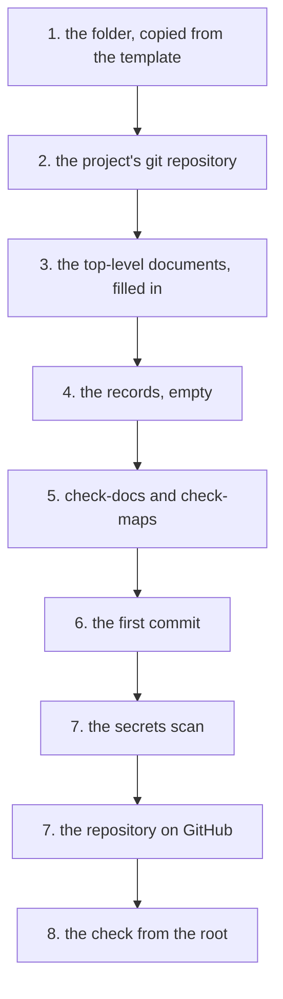

# How to start a new project

The guide goes from "nothing exists" to a project with its own repository, with the
top-level documents filled in and with a copy on GitHub. It takes about a quarter of
an hour, of which the writing part is the longest.

The environment is assumed to be already restored, with the steps in
[Quick start](../../README.md#quick-start): if `./bin/check-lock.sh` does not exit with
0, that is solved first.

⚠ **The commands marked "from the root" are given from the workspace root** (the folder
into which the environment's repository was cloned). The rest are given from the
project's folder; a command given from the wrong folder creates folders in the wrong
place, without an error.

No path in the guide is absolute, so that the steps work wherever the repository was
cloned.

## The road, in short



The folder starts as a copy of the template and becomes its own git repository. The
top-level documents are filled in and checked, the first commit is made, and before
GitHub what leaves is scanned for secrets. At the end, the root has to see the project
with its remote.

## 1. The template is copied into a new folder

The projects sit in `projects/`, each with its own repository. The folder's name is in
lowercase letters and hyphens, because it also becomes the repository's name. The
template (the `template/` folder, from which a new project starts) is copied whole.

From the root:

```bash
mkdir -p projects/<name> && cp -r template/. projects/<name>/ && ls -a projects/<name>
```

`CLAUDE.md`, `README.md`, `IMPACT.md`, `STATE.md`, `.gitignore`, `docs/` and `records/`
must appear.

⚠ **`cp -r template/. dest/` — the dot matters.** Without it, `cp -r template dest`
creates a `template/` inside the destination, instead of pouring out its content.

## 2. The repository is made, in the project's folder

From the root:

```bash
cd projects/<name> && git init -b main
```

From here on, the commands are given from the project's folder.

The repository is made in the project's folder, not at the root. The root is the
environment's repository, and `projects/` is ignored there precisely so that the two do
not get mixed.

## 3. The top-level documents are filled in

The four copied files have placeholders in angle brackets. They are filled in in this
order, because each one uses the one before:

| Order | File | What is written |
|---|---|---|
| 1 | `README.md` | what the project is, in at most three lines; "How it works", with the diagram; "Quick start"; "The map"; at the bottom, "Why it is made this way" and "The landmarks, re-measured" |
| 2 | `CLAUDE.md` | only what is **specific** to the project: the commands, what is source and what is a copy pulled from another machine, the order in which the code is read, what is not touched |
| 3 | `IMPACT.md` | what breaks if X changes, with a verification command on every row |
| 4 | `STATE.md` | the state measured today and the work of the next session |

What deserves attention in each:

- **`README.md`** — the sections come in the template's order, and each has in angle
  brackets what is written in it. The rows of "The map" that point to `IMPACT.md` and
  to `STATE.md` are **not deleted**. Without them, whoever opens the project searches
  through the folder for what should have been found from the first page.
- **`CLAUDE.md`** (the file with the rules every session of the project loads) — the
  only one allowed to disappear entirely. It loads at every session start, so a file
  left with empty sections is paid for every time without saying anything.
- What was copied into `CLAUDE.md` from the template is a list of questions. If none
  has an answer for this project, the file is deleted, and with it the row that pointed
  to it from `README.md`'s map.
- The most often skipped question is the first: **is there a folder in the repository
  that is a copy of something from another machine?** If so, a change made there is
  lost at the next sync, and it is lost by exactly whoever was not warned.
- **`IMPACT.md`**, the impact map (the table of what breaks at each change, with the
  command that checks it) — a row without a verification command is a claim that ages
  silently. The fourth column is mandatory.
- **`STATE.md`**, the state file (the project's state and what comes next, rewritten at
  every end of session) — it is written at the **end** of the first work session, not
  at the start: until then it has no state to describe.

## 4. The records start empty

`records/` holds the records: a record is a series of dated entries, which are appended
and not rewritten. It is the fifth kind of document and the only one that **is not
rewritten**.

Each entry is a standalone file, with the date in its name, left untouched after it was
written. Only the `INDEX.md` of each folder is rewritten, because it is the map of the
entries, not one of them.

| The folder | What goes into it |
|---|---|
| `records/pitfalls/` | what cost time and whose method of finding is reapplied |
| `records/journal/` | system problems solved on the project's machines: a missing package, a driver, an environment setting |
| `records/decisions/` | the project's decisions, with the reason and the history of each |
| `records/work/` | the work items with a plan, each in a folder with spec, plans and `README.md`; the index keeps the state and the backlog |

The four start empty, each with an `INDEX.md`. The first entry is written **in the
session in which the thing it describes happened**, not later: a month on, "I know I
repaired something about this" cannot be reconstructed from anything.

⚠ **A record never goes under `docs/`.** There the documents are rewritten, and a
rewrite of a record loses its old entries.

## 5. The first check, before the first commit

```bash
python3 ../../bin/check-docs.py . && ../../bin/check-maps.sh .
```

It must print `failures: 0` and `failed: 0`.

⚠ **If `check-maps.sh` says `commands run: 0`, `IMPACT.md` was not filled in.** Zero
commands run is not a pass, it is a check that looked at nothing.

## 6. The first commit says why the project exists

```bash
git add -A && git commit -q -m "<why the project exists, in one sentence>"
```

The message says why, not what: what changed shows in `git diff`, and the reason can no
longer be reconstructed. No commit carries `Co-Authored-By` or any other trace of a tool.

## 7. The copy on GitHub, after the secrets scan

What leaves is scanned first, **before** the push, not after:

```bash
git ls-files -z | xargs -0 /usr/bin/grep -InE '(api[_-]?key|token|password|secret)[[:space:]]*[:=][[:space:]]*["'\'']?[A-Za-z0-9_/+.-]{12,}|BEGIN [A-Z ]*PRIVATE KEY|ghp_'
```

⚠ **The list comes through `-z` and `xargs -0`.** Written `$(git ls-files)`, the
command silently skips the files with spaces in their names — in an imported game,
half of them.

With no match, the repository is created and pushed:

```bash
gh repo create <name> --private --source=. --remote=origin --push
```

The check that it arrived:

```bash
git status -sb | head -1 && git rev-list --count origin/main..main
```

`## main...origin/main` and `0` must appear.

## 8. The root sees the project with its remote

From the root, the new project must appear with its remote:

```bash
for p in projects/*/; do
  if [ "$(git -C "$p" rev-parse --show-toplevel 2>/dev/null)" = "$(cd "$p" && pwd -P)" ]; then
    printf '%-26s %s\n' "$(basename "$p")" "$(git -C "$p" remote get-url origin 2>/dev/null || echo 'no remote')"
  else
    printf '%-26s %s\n' "$(basename "$p")" 'NOT A REPOSITORY'
  fi
done
```

`NOT A REPOSITORY` next to the project means step 2 did not create the repository in
its folder. Why the loop first compares the repository's root is explained in
[The structure of the workspace](../reference/structure.md).

---

## Starting prompts

What is written in the session, after the folder exists. The wording matters: it brings
the right skill (a set of instructions that enters the conversation when the situation
matches), or it brings nothing.

⚠ **The session is opened in `projects/<name>`, not at the root.** Only then does the
project's `CLAUDE.md` load at launch, and the work item, the journal and `STATE.md`
end up in the project's records, not in the environment's.

The rules of the framework (the repository with the rules, skills and tools common to all
projects) load from there too, because the root is a parent.

**When it is not yet known what is being built** — brings `brainstorming`, which asks
questions before writing code:

```
I want us to build <what>. I do not have the requirements fixed yet, let us clarify them first.
```

**When the requirements are clear and the job has several steps** — brings
`writing-plans`, which writes a plan with checkable steps:

```
The requirements are fixed: <list>. Write the execution plan before touching code.
```

**When the plan exists and is being executed** — in a **new** session, on the model in
the plan header (the first lines of a plan, with the model and who merges the work),
brings the `execute` skill:

```
Execute the plan records/work/open/<folder>/<plan>.md with the execute skill.
```

**When new code is being written** — brings `test-driven-development`:

```
Write <what>, with the test before the implementation.
```

**When it is done and has to be proven** — brings `verification-before-completion`:

```
Run the checks and show the output, not the conclusion.
```

**When the documentation follows** — brings the `documentation` skill, and the values
must already be verified:

```
/caveman off
Write the project's documentation, after the Divio model.
```

`/caveman off` stops the compressed mode of the answers, so that the documentation is
written for someone outside the field. The rules of the modes are in `CLAUDE.md`, under
"Modes".

## A complete prompt, as an example

What a request that leads straight to work looks like, with the context the agent
needs:

```
New project: projects/network-measurements.

What I want: a script that measures the latency to three hosts every five minutes
and writes the results to a CSV, so that I can see when the link drops.
It runs on a small machine, so python3 with no new dependencies.

I copied the template and ran git init. I do not have the requirements fixed — I do
not yet know whether I want an alert when it drops, or only the file.

Start with the discussion, not with the code.
```

Why it works: it names the folder, says what has to happen and on what machine,
declares the only technical constraint, says what is **not** decided, and explicitly
asks for the stage to start from.

## What is done at the end of the first session

`STATE.md` is written by `end-of-session`, with what was measured in the session. The
shape of the state file and what goes into it are in the skill.
