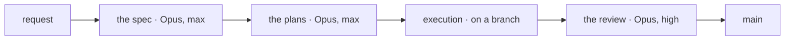

# Documentation — the details

Read **once per session**, at the moment when writing actually starts. `SKILL.md`
is re-read at every decision; this file is not.

---

## The four kinds in `docs/`, at length

The short table is in `SKILL.md`. Here sit the rules of each.

### Tutorial

A guided lesson. It takes someone who knows nothing and leads them, step by step,
to a **visible result**.

- **Must** work every time, without exceptions
- **Must** say exactly what is typed and what must appear
- **Does not** offer options, alternatives or "it can be done this way too" — they confuse
- **Does not** explain why; the explanation distracts from learning
- Ends with "what was learned" and links to the next step

A project usually has **only one**. If three were written, they are probably
how-to guides in disguise.

### How-to guide

A recipe. It answers a question that only someone with some experience could
formulate.

- **Must** have ordered, numbered steps
- **Must** be called "How to do X" — never a vague title like "Configuration"
- **Does not** explain notions; put a link to the explanation and move on
- **Is not** complete — practical usefulness beats completeness
- Leaves room for adaptation: the reader's situation differs from the example's

The difference from a tutorial: *a tutorial is what you decide must be known;
a guide is the answer to a question asked by someone who is already working.*

⚠ **Two guides with the same preliminary checks.** It happens often and produces
copied blocks. The shared checks are written **once**, in a third document, and both
guides link to it.

### Reference

The description of the mechanism. Dry, exact, complete.

- **Must** mirror the structure of the system, not the reader's logic
- **Must** be tables, lists, values
- **Does not** teach anyone anything
- **Does not** say why — only what exists and with what value
- All the values are the **real** ones, verified, not the assumed ones

### Explanation

The discussion. Here sit the reasons, the rejected alternatives, the context, the
pitfalls.

- **Must** answer "why this way and not another"
- **Must** also say what was tried and did not work
- **Does not** give instructions
- Can be read away from the computer, like an article

## The record, at length

A series of entries, not a text: the pitfalls, the journal, the decisions, the work items.

- **one file per entry**, never a file that grows
- **dated in its name** — the opposite of `docs/`, where the date is forbidden
- **not edited after it is written**, except to correct a wrong fact
- **the index is the only part that is rewritten** — it is the map, the entries are the facts
- **not read in order**, looked up by entry
- **no documentation run goes into `records/`**

## The layout on disk

```
README.md              what the project is + the map of the five kinds
docs/
├── README.md          table of contents + the difference between the kinds
├── tutorial/          usually a single document
├── how-to/            one per problem, named after what it does
├── reference/         one per area of the system, plus glossary.md
└── explanation/       one per subject that needs understanding
records/
└── pitfalls/ journal/ decisions/ work/    one file per entry, dated in its name
```

---

## "Why", not "what" — the long examples

An example of what **not** to do, in the MSDN style:

> `setTimeout(callback, delay)` — calls `callback` after `delay` milliseconds.

That could be read from the signature too. What is missing: why anyone would use
this, what pitfalls it has, what happens if `delay` is 0.

Compare:

- ❌ "The setting is `system.automount=0`."
- ✅ "The obvious setting (`merged.device=internal`) has no effect, because the
  function that mounts always calls the external variant. The correct setting is
  `system.automount=0`, which makes the script exit before it looks for an
  external card."

---

## For a reader from outside

The four rules from `SKILL.md`, § 3, with their examples. The reader already uses Claude
Code, but has not seen the house: they do not know what a handoff, a work item's folder or
the personal layer is.

### The gloss at first use

- ❌ "Execution reads the handoff and works on the branch."
- ✅ "Execution reads the handoff (the note in `STATE.md` for the next session) and works
  on the branch written in the plan header."

The gloss is copied from the glossary, where it is the first sentence of the entry, so
that it is the same in every document. A word without an entry gets one in the glossary
first, then in the document. From its second use in the same document, the word stands
alone.

### The ⚠ sign, only where silence costs

There is a single question: what is lost if the reader skips the sentence?

- ✅ "⚠ A test without the execute bit never runs, and nothing says so." Without the
  sentence, the test is missing from the suite and nobody finds out.
- ❌ "⚠ The skills brought by the application are not pinned here." Without the sentence
  nothing is lost: it is information, so an ordinary sentence.

### The heading says what is done

- ❌ "## Reading goes down, writing climbs"
- ✅ "## At the closing, what was found is written at the first level that contains it
  whole", with the aphorism, if it helps, in the text below.

### The diagram, with the text that says it in words



The text next to it: "A request goes through four new sessions: the spec, the plans,
execution on a branch and the review, which merges the branch into `main`." Without it,
screen readers and `check-docs.py` would see nothing of the diagram.

The diagram is drawn before merging. The "diagrams" configuration in
`.claude/launch.json` serves the workspace root on port 8766, and in the application's
browser `bin/diagrams.html?doc=<path of the document>` is opened. The page draws every
`mermaid` block and writes in its title "good" or the error.

From a project in `projects/`, the configuration is copied into the project's
`.claude/launch.json`, with `"--directory", "../.."` added to the arguments: the server has
to serve the workspace root, where the page sits.

---

## Pitfalls: the template and the example

A pitfall is a **record entry**, not a paragraph in an explanation. Its place is
`records/pitfalls/`, one file per entry, dated in its name.

Anything that cost time is worth writing — but **the method is more valuable than
the result**, because it is reapplied.

Template:

> ### The title of the pitfall
>
> **The symptom**, as seen from the outside.
>
> **The cause**, with concrete evidence.
>
> **Why it is a pitfall and not just a peculiarity:** usually because the obvious
> check passes, and the symptom appears later.
>
> **The method that caught it**, formulated in general terms.

A real example:

> A save placed in the folder given by the configuration has the right name, the
> right size and the right checksum. Any reasonable check passes. And yet the game
> starts from zero, because the emulator looks somewhere else.
>
> The check that catches this is not about the file, but about the program: the
> game is started, then the files modified in the last minute are searched for.
> Where one appears, that is where the program looks.

### The evidence

When a claim matters, write **how it was verified**.

- "The panel is Panel 4" → weak
- "155 of 155 initialization commands identical, identical timing, identical
  physical size" → verifiable

For visual changes, the evidence is a compared capture, not a reading of code: "zero
pixels different out of 307,200".

### The rejected alternatives

Also write what was **not** chosen, with the reason. Otherwise someone will retry them.

A "what cannot be done and why" document saves more time than many guides.

---

## The excuses

Every row below was said at the end of a long day, when the documentation was the
last thing left. They are written here so they can be recognized when they appear,
because they all sound reasonable at the moment they are said.

| The excuse | The reality |
|---|---|
| "The code explains itself" | The code says **what** it does. Why it was chosen and not another does not show in any line. |
| "I'll document after I finish the feature" | The rejected alternatives are forgotten on the same day they are rejected. |
| "I'll write only the README now, the rest later" | "Later" is exactly the moment when the reason can no longer be reconstructed. |
| "I know this value, I won't verify it again" | A value written from memory is an assumption that looks like a fact. It looks identical to a verified one. |
| "It's obvious why it was done this way" | Obvious now, to whoever did it. Not in a year, not to someone else. |
| "The pitfall is too specific to this project" | The result is specific. The method that caught it is not — and the method is written. |
| "I'll make a single document, it's easier to find" | A document that does all four is good at none. That is the first rule. |
| "I'll add an alternative to the tutorial too, it's more complete" | A tutorial with options is no longer a tutorial. Completeness is the reference's job. |
| "I'll add this pitfall to the others, in the same file" | That is how a file reaches 4078 lines. A pitfall is a record entry, not one more paragraph. |

They all mean the same thing: it is written now, with the values verified now.

---

## A project that already exists

Why the skill has a separate rule for this case: its earlier versions said "write
X" everywhere and nowhere what happens when X already exists. The second run wrote a
second document about the same thing, and the first stayed alongside, just as
visible and just as wrong.

1. **Read the code and the history** before writing a line. Documentation written
   from assumptions is worse than none.
2. **Verify every value** on the real system, not from memory.
3. **Look for what cost time** — in commits, in comments, in repeated repairs.
   That is where the pitfalls are.
4. **Ask what you cannot find out alone:** which alternatives were rejected and why.
   The reasons are never in the code.

---

## Rewriting an existing documentation to the standard

The list applies when a whole documentation goes through the rules in `SKILL.md`, § 3 and
§ 5. Each document is rewritten once, whole, in the order a new reader meets it: the
README, the glossary, the tutorial, then the rest.

A pass per rule — first the glosses everywhere, then ⚠, then the headings — would touch
each document four times, and one pass can spoil the one before it.

1. **The README** has, in order: what it is, the diagram of the way it works, the quick
   start, the map; why it is made this way and the landmarks sit at the bottom.
2. **The glossary is written first**, because the glosses are taken from it. Each entry
   starts with the short gloss, of at most about 12 words, plain to someone from outside;
   the house's nuance comes after.
3. **Every house word has its gloss at first use**, in every document.
4. **⚠ stays only where silence costs.**
5. **The headings say plainly what is done.**
6. **Every flow with more than three parts has a Mermaid diagram**, drawn without error
   with `bin/diagrams.html`.
7. **No failure and no value lost.** From the project's root:

   ```bash
   python3 ../../bin/check-docs.py .
   python3 ../../bin/values.py main README.md docs --removed <the work item's folder>/removed-values.tsv
   ```

   The first exits with 0 failures. The second exits with 0 only when every value that
   disappeared is written in the file of removed values: one line per value, with a tab
   between the value, the document and the reason. The review reads the file.

The tools' paths start from the workspace root; `../../` is the way from a project in
`projects/`. `values.py` compares documents written in the same language: for a
translation, the check stays `check-docs.py` plus the review.

---

## The person, with examples

- ✅ "The script checks the state first." · "The variables file is opened."
- ❌ "You open the file." · "If you want, you can…"
- ✅ in English, a step: "Open a new session in `projects/exercise`, then type:"

Documentation is also read by someone else, and in a year. Addressing the reader
directly ages badly and assumes a dialogue that no longer exists.

## The commit message, with examples

- ❌ "Documentation update" · "Added ai-server.md"
- ✅ "The inference server works, and the key closed the panel"

## Where the material comes from

**The pitfalls** are gathered from `superpowers:systematic-debugging`: what the
template above asks for — the symptom, the cause with evidence, the method
formulated in general terms — is exactly what a systematic debugging produces.

**The rejected alternatives** are gathered from `superpowers:brainstorming`. That is
where the variants are rejected, and that is also where they are lost if they are
not noted at the moment of rejection.

If the defect was caught methodically, the material already exists. If it was
caught by luck, it does not exist and it is **not invented**.

---

## A work item's folder

`records/work/open/<YYYY-MM-DD-subject>/`, with the date of the first spec or plan.
In projects organized by domain, the domain comes before the state:
`records/work/<domain>/open/<folder>/`.

| The file | For whom | Who writes it, and when |
|---|---|---|
| `README.md` | human | planning, together with the plan |
| `request.md` | human and agent | the human's request, word for word, when a written one existed |
| `<folder>-design.md` | agent | planning: the spec |
| `<YYYY-MM-DD-subject-plan>.md` | agent | planning: the plan, one or more |
| `closing.md` | human | at closing, through `end-of-session` |

### The folder's `README.md`

The work item's version for people; the execution does not read it. The sections,
in this order:

1. **What is being pursued** — what is obtained, said for someone outside the field.
2. **Why now** — what happened or what is missing.
3. **The steps, without code** — one sentence per task.
4. **The debatable decisions, with their risk** — so the human can overturn them.
5. **What the work item does NOT do.**
6. **How to see that it succeeded** — a command or a visible thing.
7. **Where the rest is** — the spec, the plans, the request.

No untranslated jargon; a concrete comparison instead of a definition; every number
with the sentence that says why it matters.

### `closing.md`

Written once, before the folder is moved into `closed/`. Also for humans.

```markdown
# Closing: <the title of the work item>

Date: <YYYY-MM-DD> · State: <finished · partial · abandoned · replaced by …> · Closed by: <the execution · the review>

## What came out
## Deviations from the plan
## The leftovers, each with its destination

| The leftover | The destination |
|---|---|
| <the task not done, or the point from "What is not in this plan"> | done · abandoned, because … · backlog |

## Where the evidence is
<the commits, the branch, the verifiers run at closing>
```

## The decision

`records/decisions/<YYYY-MM-DD-subject>.md`, with the date of the decision.

```markdown
# <the rule or the choice, as a sentence>

Date: <YYYY-MM-DD> · Requested by: <the human, or the work item it came out of> · Replaces: <the old decision, if any>

## The decision
## Why
## The history
<the incident, the numbers, what was tried>
## The rejected alternatives
## Where it applies
<the section in CLAUDE.md, the skill, the file>
```

A changed decision gets a new entry. The old one is not touched; its row in the
index gains "replaced by".

## The rule in `CLAUDE.md`

```markdown
### <the rule, as a short sentence>

<the exact form: what is done, when, with what command>

Reason: <one sentence>.
History: <a link to the decision, pitfall, journal or folder>.
```

The link goes where the history is already kept. A new decision is written only when
the history existed only in the text of the rule.

## Moving a record file

A record file that is moved or deleted is searched for across the whole workspace
first, not only in the repository that moves it: an entry may be quoted as an example
from any project, and the plan that moves it does not have that project on its map.

```bash
git grep -l 'records/journal/<entry-name>.md' -- projects README.md CLAUDE.md STATE.md
```

A match in a repository the plan does not touch does not stop the move, but it does
require updating the reference there, with the human's consent — usually a separate
commit, in that repository. ⚠ If the move sits on an unmerged branch, the new
reference is valid only on disk: in a fresh clone it is broken until the merge.
"Identical on GitHub" answers only "is content lost?", not "who else points at this
path?".
