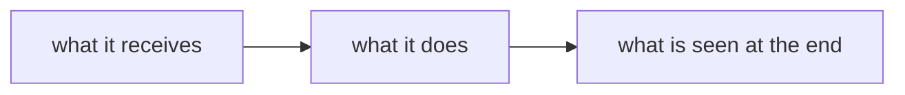

# <project name>

<What it is, in at most three lines, for someone who has never heard of the project:
what it does, for whom, and what is seen when it works.>

## How it works

<The diagram of the way it works, then two or three lines that say the same in words.
The block below is replaced; a project with a single step needs no diagram and deletes
the section.>



## Quick start

**What has to be installed**, the only list of requirements in the documentation:

| What | Version | How it is read | What does not work without it |
|---|---|---|---|
| <the tool> | <the minimum version> | `<the command that prints the version>` | <what fails> |

**The steps**, at most six commands, from the clone to the first visible result:

```bash
<the first command>
<the second command>
```

## The map

| If… | Then | Where |
|---|---|---|
| it is the first encounter and it has to be learned step by step | **Tutorial** | [docs/tutorial/](docs/tutorial/) |
| there is a concrete goal and the steps are looked for | **How-to guides** | [docs/how-to/](docs/how-to/) |
| a value, a path, the name of a setting is needed | **Reference** | [docs/reference/](docs/reference/) |
| the reason why something is done this way is needed | **Explanation** | [docs/explanation/](docs/explanation/) |
| what breaks the project if it is not known | its rules | [CLAUDE.md](CLAUDE.md) |
| what breaks if something is touched | the impact map | [IMPACT.md](IMPACT.md) |
| today's state and what comes next | the state plus the prompt | [STATE.md](STATE.md) |
| someone has hit this problem before | records | [records/pitfalls/INDEX.md](records/pitfalls/INDEX.md) |
| what is in progress and what is waiting | the work items | [records/work/INDEX.md](records/work/INDEX.md) |
| why a rule is so | the decisions | [records/decisions/INDEX.md](records/decisions/INDEX.md) |

The difference between the four kinds of text is explained in
[docs/README.md](docs/README.md).

The rows to `IMPACT.md` and `STATE.md` stay: without them, the agent searches through the
folder for what it should have found on the first page. The row to `CLAUDE.md` is deleted
together with the file, if the project has nothing to write there.

## Why it is made this way

<The decisions that cannot be seen from the code, each with its reason in one sentence and
with the link to its explanation in `docs/explanation/`.>

## The landmarks, re-measured

Figures are written as a command that prints them, not as values: a written value ages
silently and looks identical to a true one. The block below is filled in with what matters
for this project and is run from its root:

```bash
printf 'source files       %s\n' "$(git ls-files | wc -l)"
printf 'documents in docs/ %s\n' "$(find docs -name '*.md' | wc -l)"
printf 'pitfall entries    %s\n' "$(( $(ls records/pitfalls/*.md 2>/dev/null | wc -l) - 1 ))"
printf 'commits            %s\n' "$(git rev-list --count HEAD)"
```

The figures that **cannot** be re-measured with a command — a time measurement, a
benchmark result — are written in `records/`, with the date next to them, not here.
